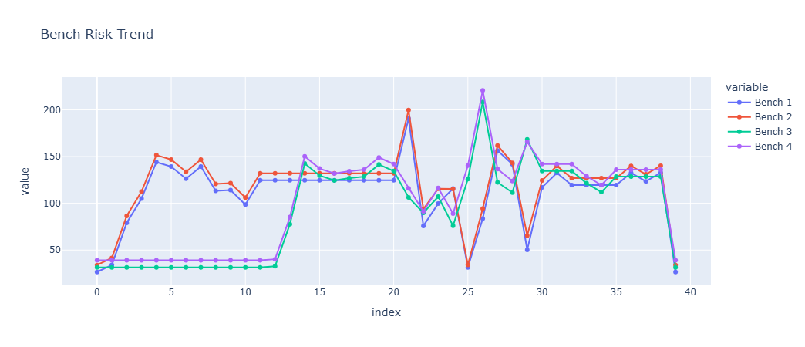
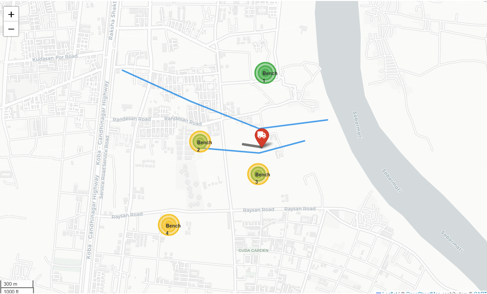
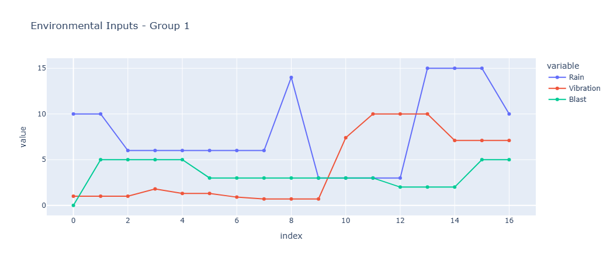

# GeoSentinal – Mine Risk Monitoring Dashboard

GeoSentinal is a geospatial mine risk monitoring prototype designed to analyze and visualize safety risks in open-pit mining environments.

The system simulates environmental and operational factors, computes bench-wise risk levels, and presents insights through interactive dashboards and GIS-based maps.

---

## 🚀 Features

### 🔧 Operating Modes
- **Manual Mode**
  - User-controlled sliders for rainfall, vibration, and blasting
  - Deterministic risk calculation for what-if analysis

- **Automatic Mode**
  - Simulates real-time sensor data using periodic updates
  - Randomized environmental inputs for continuous monitoring

### 📊 Risk Analysis
- Bench-wise risk computation based on:
  - Rainfall
  - Ground vibration
  - Blasting activity
  - Slope angle
- Risk classification into **Low / Medium / High**

### 📈 Visualization
- Interactive time-series charts for:
  - Environmental parameters
  - Bench-wise risk trends
- Tabular risk summary with visual status indicators

### 🗺️ GIS Mapping
- Interactive mine map with:
  - Benches
  - Rivers and haul roads
  - Equipment (hauler) position
- Multi-layer risk zones visualized using colored overlays
- Toggleable DEM (Digital Elevation Model) terrain overlay

### 🚁 Drone Imagery (Concept)
- Placeholder section for drone-based visual monitoring
- Designed for future integration of aerial inspection data

### 📁 Data Management
- Automatic historical data logging
- **CSV export of risk history for offline analysis and reporting**


---

## 🧠 Problem Statement

Open-pit mines face significant safety risks due to slope instability caused by rainfall, blasting, and vibration.  
Existing monitoring solutions are often reactive and fragmented.

**GeoSentinal** provides a unified, visual, and proactive decision-support system to assist mine safety management.

---

## 🏗️ System Architecture

Manual / Auto Inputs
↓
Risk Computation Engine
↓
Historical Data Store
↓
Dash Dashboard
↓
Charts + Tables + GIS Map

---

## 🛠️ Tech Stack

- Python
- Dash & Plotly (Dashboard and charts)
- Folium (GIS map visualization)
- Pandas & NumPy (Data processing)
- Rasterio & Matplotlib (DEM handling)
- Bootstrap (UI components)

---

## 📂 Project Structure

mine-risk-prototype/
│
├── app.py
├── requirements.txt
├── README.md
├── .gitignore
│
├── data/
│ └── dem_file.tif
│
├── tmp/
│ └── .gitkeep
│
└── assets/
└── screenshots/

---
## 📸 Screenshots

### Dashboard View


### GIS Map View


### Risk Charts


## ▶️ How to Run

### 1. Create virtual environment
```bash
python -m venv venv

2. Activate environment
venv\Scripts\activate

3. Install dependencies
pip install -r requirements.txt

4. Run the application
python app.py

5. Open in browser
http://127.0.0.1:8050/

🗺️ DEM Overlay

To enable terrain visualization:

Place a DEM file at data/dem_file.tif

Toggle Show DEM Overlay inside the dashboard

🚁 Drone Imagery

The dashboard includes a placeholder for drone imagery, representing future integration of:

Aerial slope inspection

Crack detection

Surface deformation monitoring

📊 Output

Real-time risk visualization
Bench-wise risk levels
Historical trend charts
CSV export for reporting

🔮 Future Enhancements

Live IoT sensor integration
Machine learning-based risk prediction
Real-time drone feed
Alert and notification system
Cloud deployment


